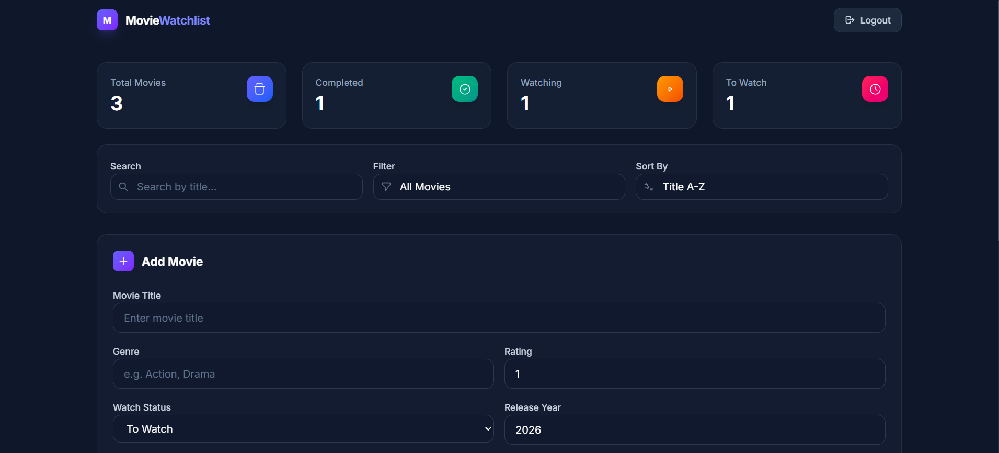
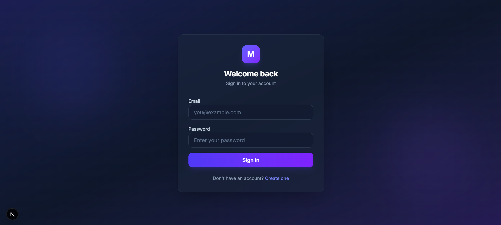
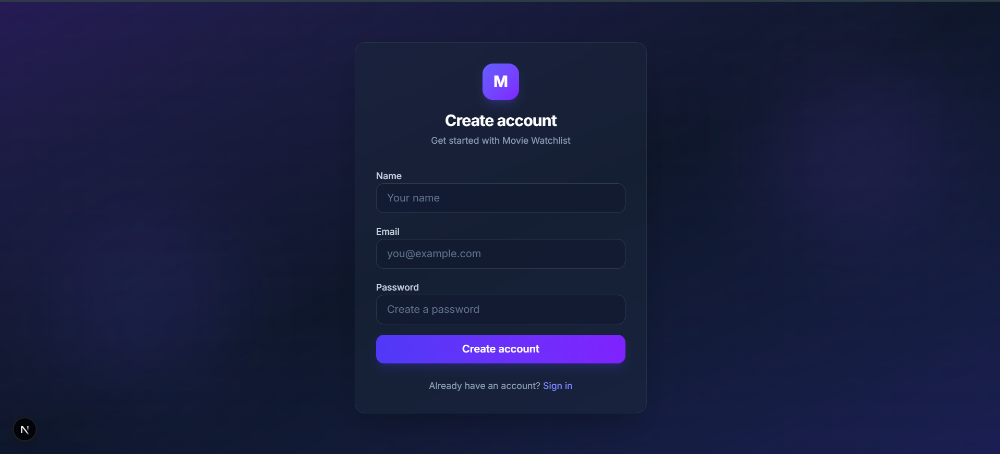
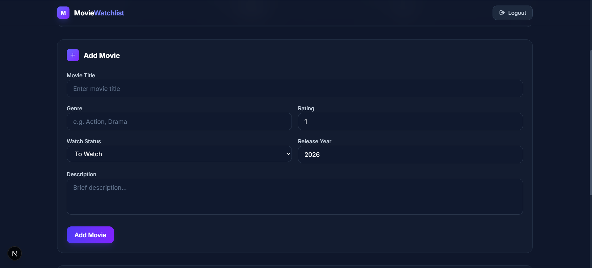
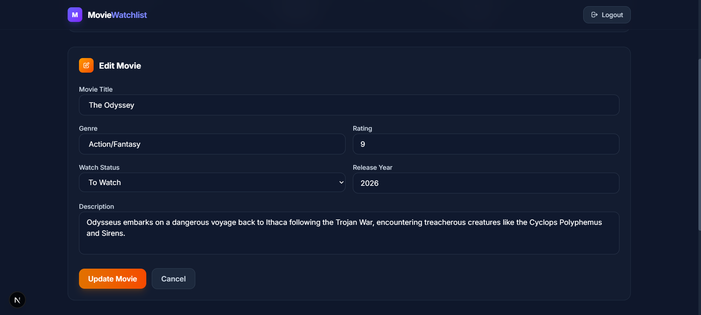
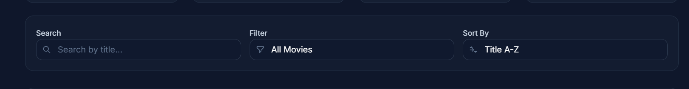
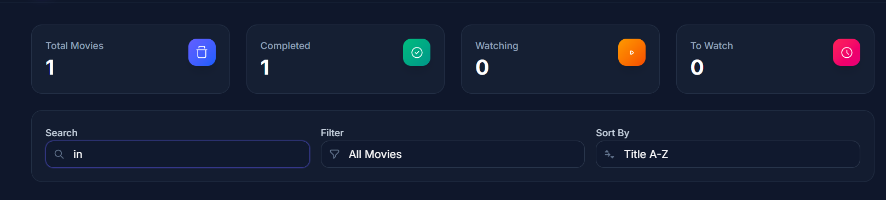
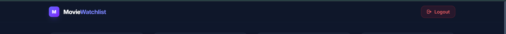

# 🎬 Movie Watchlist Backend

A RESTful backend API for the **Movie Watchlist** application built with **Spring Boot**, **Spring Security**, **JWT Authentication**, and **PostgreSQL**. The application follows a layered architecture and provides secure APIs for user authentication and movie management.

---

## 🚀 Features

- 🔐 JWT Authentication (Register & Login)
- 🔒 Protected REST APIs
- 🎬 CRUD Operations for Movies
- 🔍 Search Movies by Title
- 🎯 Filter Movies by Watch Status
- ↕️ Sort Movies
- ✅ Input Validation
- ⚠️ Global Exception Handling
- 🗄️ PostgreSQL Database Integration
- 🏗️ Layered Architecture (Controller, Service, Repository, DTO, Entity)

---

## 🛠️ Tech Stack

| Technology | Purpose |
|------------|---------|
| Java 21 | Programming Language |
| Spring Boot 3.5 | Backend Framework |
| Spring Security | Authentication & Authorization |
| JWT | Secure Authentication |
| Spring Data JPA | ORM |
| Hibernate | Database ORM |
| PostgreSQL | Database |
| Maven | Dependency Management |

---

## 📁 Project Structure

```text
movie-watchlist-backend
│
├── src/main/java
│   └── com.rahul.moviewatchlist
│       ├── config
│       ├── controller
│       ├── dto
│       ├── entity
│       ├── exception
│       ├── repository
│       ├── security
│       ├── service
│       └── MovieWatchlistBackendApplication.java
│
├── src/main/resources
│   └── application.properties
│
├── pom.xml
└── README.md
```

---

## ⚙️ Prerequisites

Ensure the following software is installed:

- Java 21
- Maven
- PostgreSQL
- Git

---

## 🗄️ Database Setup

Create a PostgreSQL database:

```sql
CREATE DATABASE movie_watchlist;
```

Update `application.properties` with your PostgreSQL credentials:

```properties
spring.datasource.url=jdbc:postgresql://localhost:5432/movie_watchlist
spring.datasource.username=YOUR_USERNAME
spring.datasource.password=YOUR_PASSWORD

spring.jpa.hibernate.ddl-auto=update
spring.jpa.show-sql=true
```

---

## 🚀 Installation

### Clone the repository

```bash
git clone https://github.com/RAHULRAJx007/movie-watchlist-backend.git
```

### Navigate to the project

```bash
cd movie-watchlist-backend
```

### Install dependencies

```bash
mvn clean install
```

### Run the application

```bash
mvn spring-boot:run
```

The backend will start at:

```
http://localhost:8080
```

---

## 🔌 API Summary

### Authentication APIs

| Method | Endpoint | Description |
|---------|----------|-------------|
| POST | `/auth/register` | Register a new user |
| POST | `/auth/login` | Authenticate user and generate JWT |

### Movie APIs

| Method | Endpoint | Description |
|---------|----------|-------------|
| GET | `/api/movies` | Get all movies |
| GET | `/api/movies/{id}` | Get movie by ID |
| POST | `/api/movies` | Add a new movie |
| PUT | `/api/movies/{id}` | Update an existing movie |
| DELETE | `/api/movies/{id}` | Delete a movie |
| GET | `/api/movies/search?title=` | Search movies by title |
| GET | `/api/movies/status?watchStatus=` | Filter movies by watch status |

> **Note:** All `/api/movies/**` endpoints require a valid JWT token in the `Authorization` header.

---

## 🔐 Authentication Flow

1. User registers using `/auth/register`.
2. User logs in using `/auth/login`.
3. Backend validates the credentials.
4. A JWT token is generated and returned.
5. The frontend stores the JWT token.
6. Protected APIs validate the token before processing requests.

---

## 🔄 Backend Workflow

```text
Client Request
      │
      ▼
Controller
      │
      ▼
Service Layer
      │
      ▼
Repository (JPA)
      │
      ▼
PostgreSQL Database
      │
      ▼
Response Returned
```

## 📸 Screenshots

### 🏠 Dashboard



---

### 🔐 Login



---

### 📝 Register



---

### ➕ Add Movie



---

### ✏️ Edit Movie



---

### 🔍 Search & Filter



---

### ↕️ Sorting



---

### 🚪 Logout



---

## ⚠️ Validation & Exception Handling

The backend includes:

- Bean Validation using Jakarta Validation
- Custom validation messages
- Global exception handling
- Resource not found handling
- Invalid request handling
- Authentication error handling

---

## 📚 References & Tools Used

The following resources and tools were used during the development of this project:

- Spring Boot Documentation
- Spring Security Documentation
- Spring Data JPA Documentation
- PostgreSQL Documentation
- JWT Documentation (JJWT)
- Maven Documentation
- **ChatGPT (OpenAI)** – Used for learning concepts, debugging issues, implementation guidance, and code refinement. All generated code was reviewed, understood, tested, and adapted before submission.

> **Note:** AI-assisted tools were used as development aids only. The backend architecture, implementation, testing, and final integration were completed with a full understanding of the code.

---

## 👨‍💻 Author

**Rahul Raj**

- GitHub: https://github.com/RAHULRAJx007
- Portfolio: https://rahulrajx007.github.io/Portfolio/

---

## 📄 License

This project was developed as part of a technical assessment to demonstrate backend development skills using **Spring Boot**, **Spring Security**, **JWT Authentication**, **REST APIs**, and **PostgreSQL**.
